# Coupled optimization and near-optimal design space of an orthogonal two-sheet cold-formed steel–concrete composite floor

## Abstract

A composite floor is proposed in which a deep trapezoidal cold-formed steel (CFS) sheet spans in the principal direction, a shallow commercial deck spans across it, and self-drilling screws at the sheet intersections anchor a normal-weight concrete topping. The primary-sheet geometry, topping thickness, deck product and gauge, and screw arrangement were enumerated exhaustively for 54 cases (spans of 4–9 m, three steel grades, three concrete strengths) under construction-stage, resistance, neutral-axis, connection and serviceability checks based on AISI S100-24 and ANSI/SDI SD-2022. The reported design is taken from within 5% of the minimum weight W\* using a secondary ranking that favours less primary steel and fewer screws. Feasible designs exist in 52 cases; none exists for S450GD–C20 at 8 and 9 m. Twenty-three reported designs coincide with W\* and the other 29 are at most 1.33% heavier. Total-service deflection governs 22 designs and web shear 12. In the Deck18G cases studied in detail, the share of feasible designs within 5% of W\* falls from 13.9% at 4 m to 0.01% at 9 m, and connection or deflection reserve becomes correspondingly expensive. Against an independently optimized W-section composite floor, 51 of the 52 paired designs are lighter (mean 11.6%) and all are shallower (mean 29.0%). Total steel is lower in 51 cases, although the primary sheet alone is heavier than the W-section from 6 m onward. The proposed designs use on average 97% of the L/240 total-deflection limit, and their strength- and stiffness-to-mass indices exceed those of the reference in only 8 and 11 cases. The gain is a lighter and shallower assembly, not higher structural efficiency per unit mass.

**Keywords:** Cold-formed steel; Composite floor; Profiled steel sheeting; Discrete optimization; Near-optimal design space; Self-drilling screw connection

## Highlights

- An orthogonal two-sheet CFS–concrete floor is optimized by exhaustive enumeration

- Reported designs lie within 1.33% of the minimum weight in all 52 feasible cases

- Near-optimal share of feasible designs falls from 13.9% at 4 m to 0.01% at 9 m

- 51 of 52 floors are lighter and all are shallower than a W-section composite floor

- Savings rely on near-full use of the L/240 limit, not on higher efficiency per mass

## Nomenclature

| **Symbol**                            | **Definition**                                                                     |
|---------------------------------------|------------------------------------------------------------------------------------|
| *A*c, *A*s      | Concrete topping and primary-sheet areas within one primary-sheet pitch            |
| b                                     | Analysed strip width (rib pitch; L/4 for the reference)                            |
| *b*f                       | Flange width of the reference W-section                                            |
| *b*p,b, *b*p,t  | Primary-sheet bottom- and top-flange widths                                        |
| Cf                         | Longitudinal force to be transferred over half the span                            |
| d                                     | Screw diameter                                                                     |
| *D*                                   | Total structural depth of the floor assembly                                       |
| *d*c, *d*t      | Concrete compression and tension damage variables                                  |
| *E*0                       | Concrete modulus of elasticity                                                     |
| E*I*eff                    | Transformed-section flexural rigidity of the analyzed strip                        |
| *E*s                       | Steel modulus of elasticity                                                        |
| *f*ck, *f*ctm   | Characteristic compressive and mean tensile strengths of concrete                  |
| *F*max, *F*0.4  | Maximum total actuator force and 0.4 of that force                                 |
| *F*y, *F*u      | Steel yield and ultimate tensile strengths                                         |
| f*′*c                      | Concrete cylinder compressive strength                                             |
| g                                     | Weight excess, 100(W − W\*)/W\*                                                    |
| *G*F                       | Mode-I fracture energy                                                             |
| *h*c                       | Concrete topping thickness above the secondary-deck crests                         |
| *h*p, *h*s      | Primary- and secondary-sheet profile heights                                       |
| *I*SM, *I*KM    | Strength-to-mass and stiffness-to-mass indices                                     |
| *L*, *L*c                  | Floor span and clear construction span of the secondary deck                       |
| *m*A                       | Modeled structural-component mass per unit area                                    |
| *M*n, *M*u      | Nominal positive flexural resistance and factored flexural demand                  |
| *n*                                   | Modular ratio *E*s/*E*0                                      |
| Nreq, Navail    | Required and available screw numbers over half the span                            |
| p                                     | Primary rib pitch                                                                  |
| Pnv                        | Nominal sheet-bearing resistance of one screw                                      |
| Rd                         | Design resistance of one screw                                                     |
| *r*s                       | Number of screw rows at each sheet intersection                                    |
| RW, RD          | Weight and depth reduction relative to the reference                               |
| *S*bot, *S*top  | Bottom and top section moduli of the steel-transformed section                     |
| tp                         | Primary-sheet base-metal thickness                                                 |
| Uc,lim, Uδ,lim  | Prescribed limits on Uconn and Uδ                            |
| Uconn                      | Connection utilization, Cf/(NavailRd)             |
| UL, UT          | Live-load and total-service deflection utilization (Uδ ≡ UT) |
| *W*                                   | Modeled structural-component self-weight intensity                                 |
| W\*                                   | Minimum feasible structural-component weight of a case                             |
| *w*, *w*1, *w*c | Crack opening, and its values at the kink and at zero stress                       |
| β                                     | Shape parameter of the Carreira–Chu compression curve                              |
| *δ*0.4                     | Midspan displacement at 0.4*F*max                                       |
| ε                                     | Allowed weight excess above W\*                                                    |
| *ε*c, ε*′*c     | Concrete compressive strain and strain at peak stress                              |
| *θ*p                       | Primary-sheet web inclination                                                      |
| ν                                     | Poisson’s ratio                                                                    |
| ρs                         | Required screw density per unit floor area                                         |
| *σ*c, *σ*ct     | Concrete compressive and tensile stresses                                          |
| ϕ                                     | Resistance factor                                                                  |

# 1. Introduction

The self-weight and depth of a floor affect the whole building. A heavier floor increases column, foundation and seismic demands, and a deeper one increases storey height and envelope area. Steel–concrete composite floors reduce both by placing the concrete in compression and the steel in tension, while profiled sheeting doubles as formwork. How much is gained in practice depends on how well the steel profile, the concrete and the shear connection are matched.

This matching makes floor design a coupled problem. A shallower steel profile weighs less but needs more concrete and deflects more; a wider flange changes the number of connector positions; a deeper secondary deck adds trough concrete. Minimizing the primary member does not, in general, minimize the floor, so a new floor type has to be optimized as an assembly and checked at both the construction and the completed stage.

Studies on CFS composite members show that resistance models do not transfer easily between configurations. Rahnavard et al. [1] tested built-up CFS beams connected to lightweight-concrete slabs and found that overestimating the resistance of the bolted connectors led to unconservative beam predictions. Their parametric study [2] identified limits of EN 1994-1-1 and AISC 360 related to connector resistance and local buckling, and a dedicated design method followed [3]. For CFS joists with wood-based boards, Kyvelou et al. [4,5] showed that fastener spacing, adhesive and gaps between boards control the degree of shear connection and the flexural response.

Self-drilling screws have also been used as shear connectors. Li et al. [6] tested CFS composite trusses in which double-threaded self-drilling screws passed through profiled sheeting into the top chord, with their heads embedded in the slab. They measured small interface slip, saw no connector damage, and showed that the strength and stiffness of the connection influence the flexural capacity and failure mode. Tests on screw-connected CFS trusses with strengthened joints [7] likewise show that joint detailing controls the load path in such members.

None of these studies deals with a floor made of two profiled sheets of different depth laid at right angles and connected at their intersections, and none treats the choice of such a floor as a search over a discrete design space. This paper addresses three questions for that configuration: (i) which geometry is selected when construction-stage, resistance, neutral-axis, connection and serviceability checks act together; (ii) how wide the near-optimal region is, and how much weight is needed to gain connection or deflection reserve; and (iii) how the result compares with a conventional composite floor optimized for the same loads, in terms of assembly weight and depth, steel content, serviceability and mass-normalized performance.

Section 2 describes the floor and its design checks, Section 3 the search and selection procedure, and Section 4 the results and the comparison. Section 5 presents finite element (FE) models of three reported designs. Limitations are discussed in Section 6 and conclusions drawn in Section 7.

# 2. Proposed floor system

## 2.1 System concept

The floor consists of two orthogonal trapezoidal steel sheets and a concrete topping (Fig. 1). The deeper primary sheet spans in the principal direction. The shallower secondary deck spans between primary-sheet corrugations, serves as permanent formwork and transfers gravity load to the primary sheet at the intersections. Concrete fills the deck troughs and continues above the crests; the topping thickness hc is measured from the deck crest. Two orthogonal layers of 8 mm bars control shrinkage and temperature cracking and are ignored in the resistance and rigidity calculations.

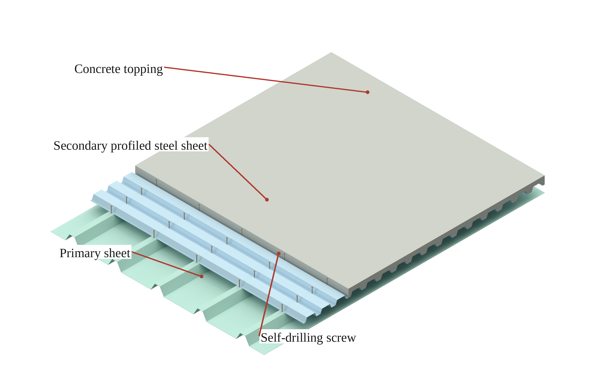

Concrete topping

Primary profiled sheet

Secondary profiled sheet

Screw

Fig. 1. Proposed floor system.

At each intersection, PATTA M6.3/5.5 double-threaded self-drilling screws fasten the two sheets, with the head and upper thread left in the topping (Fig. 2). The detail follows the connector arrangement tested by Li et al. [6], adapted to two orthogonal sheets.

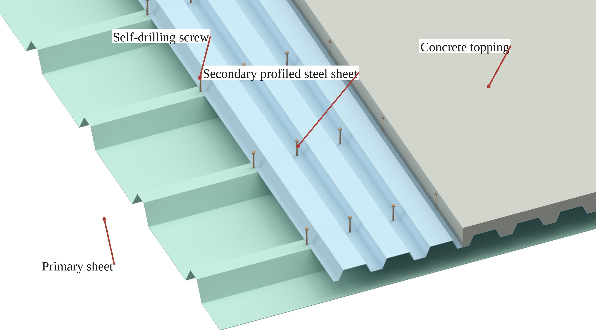

Fig. 2. Screw connection between the primary sheet, the secondary deck and the concrete topping.

## 2.2 Materials

Three steel cases and three concrete strengths are used throughout (Table 1). The S280GD and S450GD properties are taken from Rahnavard et al. [3]. Deck18G is based on six ASTM A370 coupons of 18-gauge deck steel [8] with a mean thickness of 1.18 mm, Fy = 400.1 MPa, Fu = 499.2 MPa and an engineering strain at maximum stress of about 0.165. The labels identify material sources only; the primary-sheet thickness remains a design variable.

Table 1. Mechanical properties of the cold-formed steel cases.

| **Case**      | **Experimental basis**                    | **t (mm)**         | **E (GPa)** | **ν** | ***F*y (MPa)** | ***F*u (MPa)** | **Role in study**  |
|---------------|-------------------------------------------|--------------------|-------------|-------|---------------------------|---------------------------|--------------------|
| S280GD [3]  | CFS beam/deck coupon curve                | not gauge-specific | 204         | 0.30  | 306.8                     | 424.0                     | Lower grade        |
| Deck18G [8] | Six deck coupons; mean measured thickness | 1.18               | 200\*       | 0.30  | 400.1                     | 499.2                     | Intermediate grade |
| S450GD [3]  | CFS beam/deck coupon curve                | not gauge-specific | 203         | 0.30  | 483.0                     | 613.0                     | Upper grade        |

\*The FastFloor report [8] uses E = 203.4 GPa; E = 200 GPa is used here in both the analytical and the FE models. Engineering-strain cut-offs of 0.200, 0.165 and 0.137 are applied to S280GD, Deck18G and S450GD in Section 5.1.1. The steel density is 7850 kg/m³.

The concrete has a density of 2500 kg/m³ and a Poisson’s ratio of 0.20. Its modulus, E0 = 0.043wc1.5√f′c (MPa), is 24.04, 28.44 and 31.80 GPa for C20, C28 and C35, which denote cylinder strengths of 20, 28 and 35 MPa. Where the fib expressions of Section 5.1.3 require fck, it is taken numerically equal to f′c.

## 2.3 Design methodology

### 2.3.1 Loading and design basis

A strip one primary-sheet pitch wide is analysed as simply supported under uniform load. The dead load D comprises the two sheets, the trough concrete and the topping, plus 1.873 kN/m² of flooring and 0.981 kN/m² of partitions; the live load L is 2.0 kN/m². Resistance is checked for 1.2D + 1.6L, and deflections are computed under unfactored D + L (total service) and L (live load). During concreting the secondary deck spans unshored between primary-sheet corrugations. In the completed floor only the primary sheet and the concrete above the deck crests enter the transformed section; the deck and the trough concrete contribute weight and geometry only.

### 2.3.2 Completed composite floor

An elastic transformed-section analysis gives the neutral-axis position, the section moduli and the flexural rigidity EIeff. The nominal positive flexural resistance is

$M_{n}\  = \ min(F_{y}S_{bot},\ 0.70{f'}_{c}nS_{top})$ (1)

where Sbot and Stop are the bottom and top section moduli and n = Es/E0 is the modular ratio; ϕ = 0.90. The 0.70f′c bound limits the elastic stress in the topping.

The web shear resistance follows Section G2 of AISI S100-24 [9] with kv = 5.34 and ϕv = 0.90. Each inclined web is treated as unstiffened, its depth is taken as the full centreline length, and the strip resistance is the sum of the vertical components of the two web resistances. Webs with h/t > 200 are rejected, since Section B4 bounds the range over which these expressions apply.

The resistance of one screw is governed by bearing in the primary sheet (Eq. J4.3.2-1 of [9]),

$P_{nv} = 2.7t_{1}dF_{u1}$ (2)

where t1, d and Fu1 are the primary-sheet thickness, the screw diameter (6.3 mm) and the primary-sheet ultimate strength, with ϕ = 0.55. The secondary deck is held by the concrete and moves with the primary sheet, so its share of the longitudinal force is neglected. The design resistance per screw is the smaller of ϕPnv and the shank limit of Section J4.3.3, 0.50 × 12.27 = 6.135 kN, where 12.27 kN is the laboratory shear strength published by the manufacturer. The shank limit controls for primary sheets thicker than about 1.55, 1.31 and 1.07 mm in S280GD, Deck18G and S450GD, respectively. The longitudinal force to be transferred over half the span is

$C_{f}\  = \ min(0.85{f'}_{c}A_{c},\ A_{s}F_{y})$ (3)

where Ac and As are the topping and primary-sheet areas within one pitch. The 0.85 factor bounds the force the topping can deliver and is distinct from the elastic 0.70f′c limit of Eq. (1). The required half-span screw number Nreq is Cf divided by the design resistance per screw, rounded up. Screws can be placed only at sheet intersections, in one or two rows, or four where the deck bottom flange is at least 45 mm wide. The smallest sufficient row number is used, and Uconn = Cf/(NavailRd) expresses the demand relative to the capacity of the Navail available half-span positions, Rd being the design resistance per screw.

Deflections are calculated from the uncracked transformed section and are short-term values; creep, shrinkage and cracking under sustained load are not included.

### 2.3.3 Secondary deck at the construction stage

For each primary geometry and topping thickness, every commercial deck product [10] is checked as unshored formwork spanning between primary corrugations, with the clear span Lc and bearing length fixed by the primary profile. The bare deck carries the wet concrete wdc, its own weight wdd, a construction load wlc = 0.958 kN/m² or alternatively a concentrated load Plc = 2.19 kN per metre width, and a bare-deck load wcdl = 2.394 kN/m². The factored combinations are 1.6wdc + 1.2wdd + 1.4wlc, 1.6wdc + 1.2wdd + 1.4Plc (Plc in the most adverse position) and 1.2wdd + 1.4wcdl. Flexure, shear and web crippling are checked against the catalogue resistances, and the deflection under wdc + wdd is limited to the lesser of Lc/180 and 19 mm, following ANSI/SDI SD-2022 [11]. Since the ponding allowance of Section 2.1(2) of that standard is triggered only above 19 mm, it is never required for a feasible deck, which was confirmed for every reported design. The lightest passing gauge of each product is retained. In the reported designs, web crippling governs this stage in 35 cases and flexure in 17, while the construction deflection does not exceed 17% of its limit.

### 2.3.4 Feasibility criteria

A candidate is feasible when its geometry is valid and h/t ≤ 200; the transformed neutral axis lies above the primary sheet; Mu ≤ ϕMn and the factored web shear does not exceed its resistance; the topping can develop the compression needed to balance the tensile force of the primary sheet; the required screws fit the available positions; the deck passes all construction-stage checks; and the completed floor satisfies δD+L ≤ L/240 and δL ≤ L/360. Both deflection limits are code limits and do not depend on the reference floor.

## 2.4 Conventional reference floor

The reference is a fully composite floor of W-section beams, a commercial composite deck with ribs perpendicular to the beams, and headed studs. The beams are shored and the deck spans unshored between them. Beam spacing, tributary width and effective slab width are all L/4; the clear deck span is L/4 − bf and the bearing length bf/2, where bf is the flange width. Clear span is the usual basis for deck design in SD-2022 [11]. The beams take the steel properties of Table 1, while the deck keeps its Grade 50 yield strength of 344.74 MPa. Bare-deck and web-crippling properties come from the Vulcraft catalogue [10] and composite deck–slab capacities from the manufacturer’s calculation reports [12]. Beam checks follow AISC 360-22 [13]. Deflections use the full transformed moment of inertia, which for full composite action coincides with the effective moment of inertia of Commentary Section I3.2 and gives a lighter reference than the lower-bound alternative. The reference weight includes the W-section, deck, trough concrete and topping, so both floors are weighed on the same component boundary.

# 3. Optimization framework

Both floors are optimized by exhaustive enumeration, one case at a time. Enumeration suits the problem because every variable is discrete, the deck products and gauges are catalogue items, and the feasibility boundaries are discontinuous.

## 3.1 Objective and design variables

The objective is the structural-component weight W (kN/m²), the sum of the primary sheet, secondary deck, trough concrete and topping. Reinforcement, fasteners and temporary supports are excluded, and the superimposed loads, identical for every candidate, enter the demand but not the objective. The variables are listed in Table 2 and shown in Fig. 3. The six primary and topping variables give 15,924,480 combinations per case, each paired with the applicable deck products and a screw arrangement. About 98.4 million feasible candidates were retained over the 54 cases of Table 3.

Table 2. Discrete design variables of the proposed floor.

| **Variable**                | **Symbol**        | **Search domain**          | **Increment or admissible values**                            |
|-----------------------------|-------------------|----------------------------|---------------------------------------------------------------|
| Primary-sheet height        | *h*p   | 70–350 mm                  | 10 mm                                                         |
| Primary bottom-flange width | *b*p,b | 50–700 mm                  | 10 mm                                                         |
| Primary top-flange width    | *b*p,t | 50–300 mm                  | 10 mm                                                         |
| Primary web inclination     | *θ*p   | 45–90°                     | 5°                                                            |
| Primary-sheet thickness     | *t*p   | Discrete                   | 0.37846, 0.45466, 0.60706, 0.75, 0.91, 1.20, 1.52 and 1.90 mm |
| Concrete topping thickness  | *h*c   | 50–80 mm                   | 10 mm                                                         |
| Secondary-deck product      | —                 | Commercial catalogue       | Product-specific geometry                                     |
| Secondary-deck gauge        | —                 | Available catalogue gauges | Lightest feasible gauge retained per product                  |
| Screw rows per intersection | *r*s   | Discrete                   | 1, 2 or, where permitted, 4 rows                              |

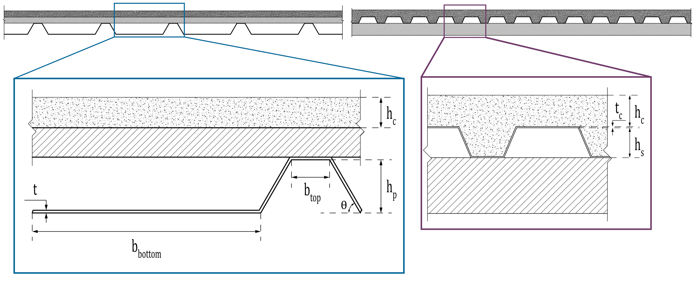

Fig. 3. Geometric variables of the proposed floor: (a) section across the primary corrugations; (b) longitudinal section.

Table 3. Case matrix.

| **Matrix factor**  | **Symbol** | **Discrete levels**                            | **Count** |
|--------------------|------------|------------------------------------------------|-----------|
| Floor span         | *L*        | 4, 5, 6, 7, 8 and 9 m                          | 6         |
| Primary-steel case | —          | S280GD, Deck18G and S450GD                     | 3         |
| Concrete strength  | —          | C20, C28 and C35                               | 3         |
| Complete matrix    | —          | 6 spans × 3 steel cases × 3 concrete strengths | 54        |

## 3.2 Selection of the reported design

For each case the minimum feasible weight W\* is found first. Candidates with W ≤ 1.05W\* are then ranked by primary-sheet weight, required half-span screw number, total depth D, Mu/ϕMn and, last, the largest EIeff; the candidate index breaks exact ties. The reported design may therefore be up to 5% heavier than W\* in exchange for less primary steel, fewer screws or a shallower floor. The weight excess of any candidate is written g = 100(W − W\*)/W\*.

## 3.3 Search and selection for the reference floor

The reference search covers the 289 W-sections of the AISC database v16.0 [14] and four Vulcraft profiles (1.5VL-36, 1.5VLR-36, 2PLVLI-36 and 3PLVLI-36) in gauges 22, 20, 19, 18 and 16 (0.749–1.519 mm); gauge 19 of 1.5VLR-36 is excluded because composite data are not available. Toppings are restricted to the catalogue values of 50.8, 60.0, 70.0 and 80.0 mm. One or two 19 mm studs per rib (height 76.2 mm, Fu = 450 MPa) are considered, with Rg = 1.00 or 0.85 and Rp = 0.60. Deck alternatives that pass both the construction and composite stages proceed to the beam flexure, web shear, deflection and full-interaction stud checks. A single stud per rib is assumed to be welded over the beam web, which exempts it from the 2.5tf diameter limit of Section I8.1 of AISC 360-22; the limit is enforced for two studs per rib. The stud-number check is left out when identifying the most utilized reference check, because rounding the stud number up keeps its ratio just below unity by construction. The reference design is selected with the same 5% band and an analogous ranking: W-section weight, required stud number before pairing, depth, flexural utilization and rigidity. The two rules are not identical because the primary members and connector groupings differ.

## 3.4 Algorithm

Each primary geometry receives a deterministic index before parallel dispatch. Geometric screening precedes the deck checks, which precede the full composite evaluation, so most candidates are rejected cheaply (Fig. 4). Feasible candidates are stored in compact form and ranked centrally, which makes the result independent of the execution order. Both W\* and the reported design are then rebuilt with the full evaluator and accepted only if their ranking keys, deck product, gauge and feasibility are reproduced.

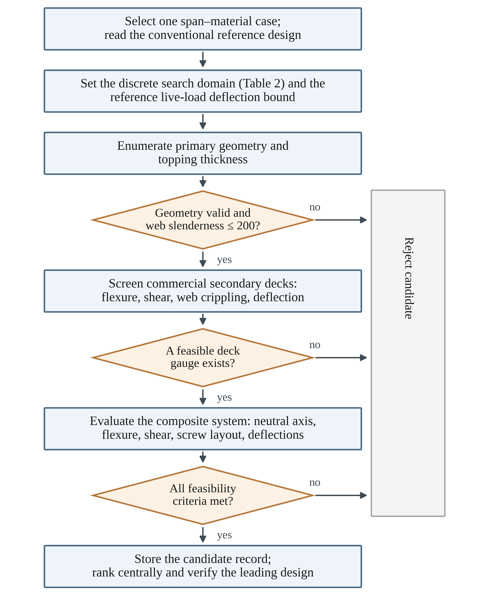

Fig. 4. Enumeration, screening and verification sequence for one case.

## 3.5 Design-space post-processing

Four Deck18G cases are examined in detail because they cover short, intermediate and long spans with different governing checks: 4 m–C28 (total deflection), 6 m–C20 (steel–concrete force balance), 8 m–C28 (web shear) and 9 m–C28 (connection capacity). All feasible designs of these cases with g ≤ 5% were re-evaluated with the design routines, which reproduced the stored weights and screw numbers exactly. Three quantities are derived from them: the number N(ε) of designs with g ≤ ε; the lowest Uconn and Uδ = δD+L/(L/240) obtainable within a given weight excess, separately and jointly; and the screw density ρs = 2Nreq/(Lp), where p is the primary rib pitch. These quantities describe the discrete search space and are not probabilistic measures of robustness.

# 4. Results

## 4.1 Feasibility and reported designs

Feasible designs exist in 52 of the 54 cases; no feasible S450GD–C20 design exists at 8 or 9 m within the bounds of Table 2. The reported weights range from 1.485 to 1.813 kN/m² and the depths from 134.7 to 325.3 mm (Fig. 5). Up to 8 m the weights stay between 1.48 and 1.58 kN/m², with one exception: S450GD–C20 at 7 m, the last feasible span of that combination, weighs 1.813 kN/m² because it needs a 60 mm topping and a 220 mm deep, 1.20 mm primary sheet. At 9 m four designs reach 1.71–1.73 kN/m², and all four use the 26-gauge decks D3 or D4. The hollow markers in Fig. 5 show that W\* lies close to the reported weight in every case.

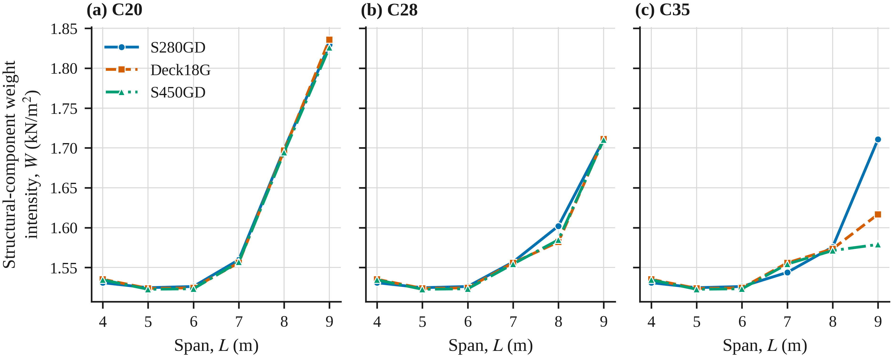

Fig. 5. Reported structural-component weight (a–c) and total depth (d–f) against span for the three steel cases. Filled markers: reported design; hollow markers: minimum feasible weight W\*.

Profile height and sheet thickness increase with span, from 70–120 mm and 0.45–0.61 mm at 4 m to 210–250 mm and 1.20–1.52 mm at 9 m (Fig. 6). The topping is at its 50 mm lower bound in 51 designs and the top flange at its 50 mm lower bound in 37, so both values are set by the search limits. Deck D1 (0.6C-30/0.6C-35) is used in 21 designs and D2 (0.6C-36) in 27; D3 and D4 appear only at 9 m. Forty-five designs need two screw rows per intersection, seven need one and none needs four (Fig. A1). The topping is the heaviest component of every reported design (Fig. A2).

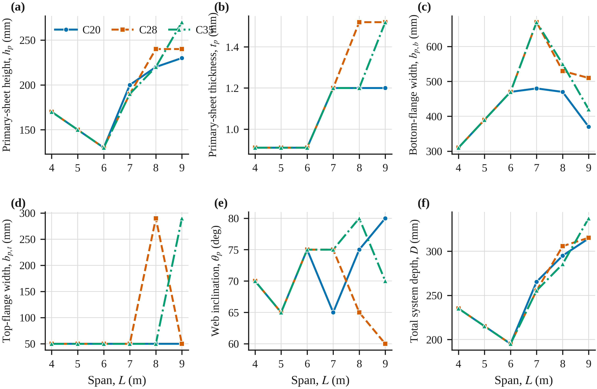

Fig. 6. Primary-sheet geometry of the reported designs. Colour steps follow the discrete search grid and are common to the three steel cases; n.f. = no feasible design.

## 4.2 Constraint utilization

Fig. 7 gives every utilization ratio of the reported designs. Total-service deflection is the most utilized check in 22 designs, web shear in 12, the steel–concrete force balance in 9, the neutral-axis position in 4, flexure and connection capacity in 2 each, and web slenderness in 1. The governing ratio is at least 0.974 in all designs. Live-load deflection never governs; its ratio lies between 0.35 and 0.47 because, for the present load ratio, the L/240 limit under D + L is the stricter one. Other checks often sit close to the governing one: 99 non-governing ratios are 0.95 or higher, so the governing label alone understates how many limits are active.

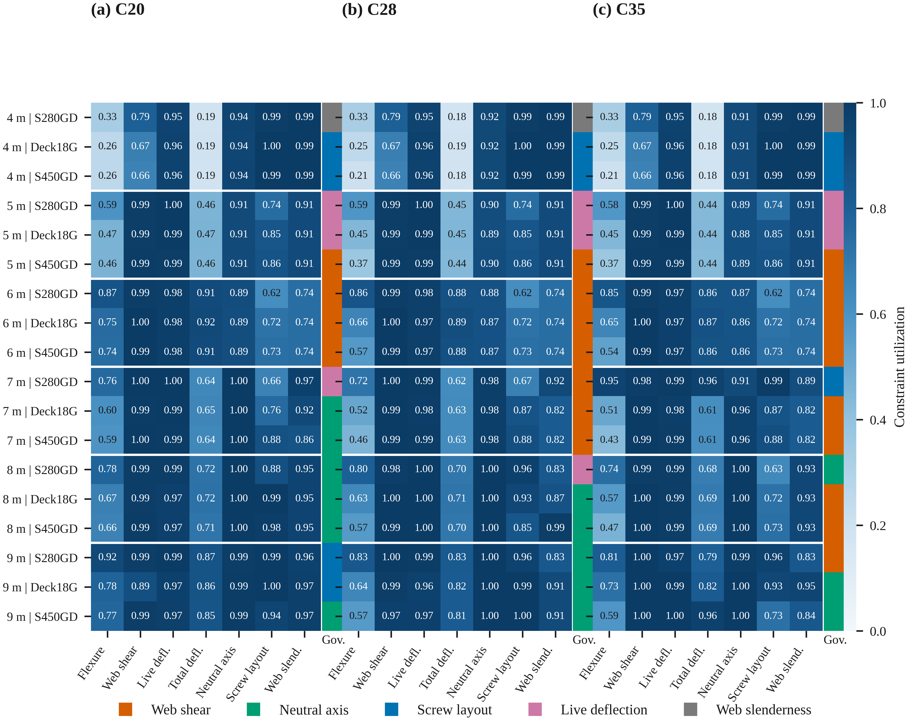

Fig. 7. Utilization ratios of the reported designs. The orange frame marks the largest ratio in each row and dashed white frames other ratios of at least 0.95; hatched rows have no feasible design.

## 4.3 Near-optimal design space

The four detailed cases have 190,889 to 1,323,348 feasible designs, but their low-weight portions differ widely (Fig. 8). Within g ≤ 5% lie 123,533 designs (13.90%) at 4 m–C28, 23,234 (12.17%) at 6 m–C20, 45,651 (3.45%) at 8 m–C28 and only 101 (0.012%) at 9 m–C28. A large feasible population therefore does not imply a broad low-weight region.

Fig. 8. Feasible weight–depth space of the four detailed Deck18G cases (left) and the region w ≤ 1.07W\* (right). Grey: all feasible designs (log density); orange: g ≤ 5%; star: minimum-weight design; diamond: reported design.

The cumulative counts in Fig. 9 show the same contraction. The 4 and 6 m curves rise steeply below 2% excess and the 8 m curve more slowly, while the 9 m curve stays at 101 designs between about 2.5% and 7% before rising again. Within the 5% set the designs form several geometry families rather than a single neighbourhood of W\* (Fig. B1). At 9 m only one family is left: all 101 designs use 1.52 mm sheets, 240–270 mm profiles and, with one exception, deck D2.

Fig. 9. Number (a) and share (b) of feasible designs with weight excess g ≤ ε for the four detailed cases. Dashed lines mark 1%, 3% and 5%.

The reported design uses little of the 5% allowance (Fig. 10). It coincides with W\* in 23 cases and is 0.86–1.33% heavier in the other 29, giving a mean excess of 0.68% over all 52. The secondary ranking lowers the primary-steel weight but does not consistently reduce depth: ten reported designs are 8.3–18.4 mm shallower than the corresponding minimum-weight design, 19 are 1.4–11.4 mm deeper and 23 have the same depth.

Fig. 10. Weight excess of the reported design over W\* against the depth difference between the minimum-weight and the reported design. Positive values: the reported design is shallower.

## 4.4 Weight cost of reserve

Fig. 11 shows the weight needed to keep Uconn and Uδ below chosen limits at the same time. At 4 m–C28 both ratios can be brought down to 0.8 for 0.29% extra weight, and Uconn ≤ 0.6 together with Uδ ≤ 0.4 costs 2.78%. At 6 m–C20 the 0.8/0.8 point costs 0.24%, but no design in the 5% set combines Uconn ≤ 0.6 with Uδ ≤ 0.6. At 8 m–C28, Uδ cannot fall below about 0.69, and at 9 m–C28 the only designs within the band have Uconn ≥ 0.845 and Uδ ≥ 0.94. Taken one at a time (Fig. B2), Uconn reaches about 0.50 within 1% excess at 4–8 m, a floor set by the rule that uses the fewest sufficient rows, whereas at 9 m it stays at 0.85. The lowest Uδ at 5% excess is 0.16, 0.37, 0.69 and 0.94 for the four spans.

Fig. 11. Weight excess needed to satisfy Uconn ≤ Uc,lim and Uδ ≤ Uδ,lim simultaneously. Hatched cells: no design within g ≤ 5%, which does not mean that no feasible design exists outside that band.

Screw density offers a further choice (Fig. B3). Minimizing it costs 1.50, 0.82, 0.63 and 0.99% of W\* in the four cases and lowers the density by 31, 14, 2 and 3%. At 4 and 6 m the reported design is dominated, since other designs in the 5% set are both lighter and need fewer screws; at 8 m it coincides with W\*, and at 9 m it has the lowest screw density. Screw density indicates the amount of connection work and is not a cost estimate.

## 4.5 Comparison with the conventional floor

The two floors are compared at the same span, steel case, concrete strength and loads. For a weight, depth or deflection X the reduction is

$\Delta X(\%) = \frac{X_{conv} - X_{prop}}{X_{conv}} \times 100$ (4)

so positive values favour the proposed floor. Component differences are written as

$\Delta W_{i} = W_{i,prop} - W_{i,conv}$ (5)

where Wi is the weight of component i; negative values are savings. Two mass-normalized indices are used:

$I_{SM} = \frac{\phi M_{n}/b}{m_{A}}$ (6)

$I_{KM} = \frac{(EI)_{eff}/b}{m_{A}}$ (7)

where ϕMn and EIeff belong to one analysed strip of width b (the rib pitch for the proposed floor, L/4 for the reference) and mA is the structural-component mass per unit area. With Mn in kN·m and EIeff in kN·m², the indices are in kN·m²/kg and kN·m³/kg. Values already expressed per metre width are divided by mA only. Paired statistics use the 52 cases in which both floors are feasible.

### 4.5.1 Weight and depth

The reference is feasible in all 54 cases (Fig. 12). All reference designs use the 1.5VL-36 deck with a 50.8 mm topping and one stud per rib, weigh 1.74–1.80 kN/m², and are governed by deck flexure at the construction stage (30 cases), total deflection (18) or beam flexure (6). The proposed floor is lighter in 51 of the 52 paired cases. The exception, S450GD–C20 at 7 m, is 3.4% heavier because of its thicker topping but 13.1% shallower. The mean weight reduction is 11.6%; it falls from 15.1–16.6% at 4 m to 3.5–12.0% at 9 m. Every proposed design is shallower, by 29.0% on average and by 0.7–43.1% overall (Fig. 13). In Fig. 14, 51 cases lie in the lighter-and-shallower quadrant, so the depth reduction is not obtained at the expense of weight.

Fig. 12. Feasibility of both floors and weight reduction RW of the proposed floor for the 54 cases.

Fig. 13. Paired weight (a) and depth (b) of the two floors by span. Grey: conventional floor; coloured: proposed floor by steel case.

Fig. 14. Weight reduction against depth reduction for the 52 paired cases. Colour: steel case; marker: concrete strength; size: span.

### 4.5.2 Steel content

With steel defined as W-section plus deck for the reference and as the two sheets for the proposed floor, the proposed floor uses less steel in 51 of the 52 cases (Fig. 15). The mean reduction is 55.6% at 4 m and 39.4, 21.8, 15.3, 9.4 and 11.4% at 5–9 m. The primary member alone behaves differently (Figs. C5 and C6). The primary sheet is on average 55.3 and 26.7% lighter than the W-section at 4 and 5 m, but 9.2, 16.7, 25.4 and 27.3% heavier at 6–9 m, and it is lighter in only 18 of the 52 cases. Beyond 5 m the steel saving thus comes from replacing the 20- or 22-gauge composite deck with a 26- or 28-gauge secondary deck, not from a lighter flexural member. The component differences (Fig. C3) show that trough concrete gives the largest saving in 48 cases and the deck in the remaining 4; in the 7 m S450GD–C20 case a 0.23 kN/m² topping increase outweighs all other savings.

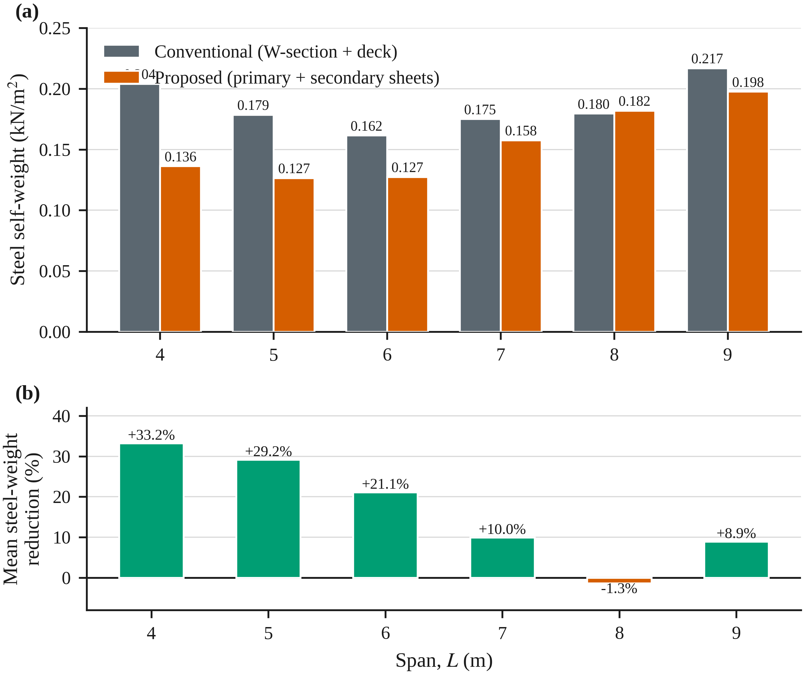

Fig. 15. Steel weight of the two floors: (a) span-wise means with min–max ranges; (b) mean paired reduction. Conventional steel: W-section and deck; proposed steel: primary and secondary sheets.

### 4.5.3 Serviceability

Relative changes in deflection are misleading at short spans, where the reference deflects very little; at 4 m the mean increase in live-load deflection is 387% (Fig. C4). Fig. 16 therefore compares the utilization of the common limits, UL = δL/(L/360) and UT = δD+L/(L/240). For the proposed floor UL lies between 0.35 and 0.47, whereas UT is at least 0.95 in 46 of the 52 designs, with a mean of 0.97 and a minimum of 0.75. The mean UT of the reference is 0.20, 0.47, 0.94, 0.69, 0.73 and 0.87 at 4–9 m, against 0.94, 0.98, 0.99, 0.97, 0.99 and 0.99 for the proposed floor. Both floors meet the limits, but the proposed floor gains much of its weight and depth advantage by using nearly all of the permitted total deflection.

Fig. 16. Deflection utilization of the paired designs: (a) live load, L/360; (b) total service load, L/240. Diamonds: span-wise mean; whiskers: min–max; faint points: individual cases.

### 4.5.4 Mass-normalized resistance and rigidity

The proposed floor has the higher strength-to-mass index in 8 of the 52 cases and the higher stiffness-to-mass index in 11 (Fig. 17). The reference, with a W-section acting on an effective width of L/4, provides more resistance and rigidity per unit mass in most cases. These indices compare efficiency and say nothing about safety, since both floors satisfy their own checks. The advantage of the proposed floor is therefore lower weight and depth rather than higher structural efficiency per unit mass.

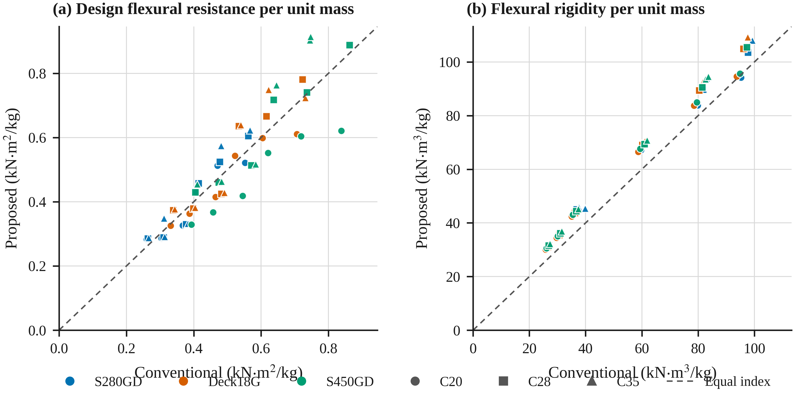

Fig. 17. Strength-to-mass (a) and stiffness-to-mass (b) indices of the two floors. ϕMn and EIeff refer to one analysed strip of width b; dashed line: parity.

# 5. Finite element modelling

Nonlinear FE models of the reported Deck18G–C28 designs at 4, 6 and 8 m were built in Abaqus/Explicit to check the analytical resistance and rigidity and to examine how the longitudinal force is shared among the screws. Their primary sheets are 70, 120 and 190 mm deep and 0.45, 0.91 and 1.20 mm thick, combined with decks D2, D1 and D1 and a 50 mm topping (Table A1). The specimens are loaded in four-point bending, whereas the design assumes uniform load, so the comparison is made in terms of moment resistance and equivalent rigidity.

## 5.1 Constitutive models

Steel is modelled with rate-independent isotropic elastoplasticity and concrete with the Concrete Damaged Plasticity (CDP) model [15]. The elastic and strength parameters are those of Section 2.2.

### 5.1.1 Cold-formed steel

The sheets use von Mises plasticity with associated flow and isotropic hardening. Engineering stress–strain data are converted to true stress and logarithmic plastic strain [15] through

$\sigma_{true}\  = \ \sigma_{eng}(1\  + \ \varepsilon_{eng})$ (8)

$\varepsilon_{pl,true}\  = \ ln(1\  + \ \varepsilon_{eng})\  - \ \frac{\sigma_{true}}{E_{s}}$ (9)

where σeng and εeng are the engineering stress and strain. The first pair is assigned zero plastic strain at yield, and the conversion stops at the pre-necking cut-offs given in Table 1 (Fig. 18). Fracture, damage and element deletion are not modelled.

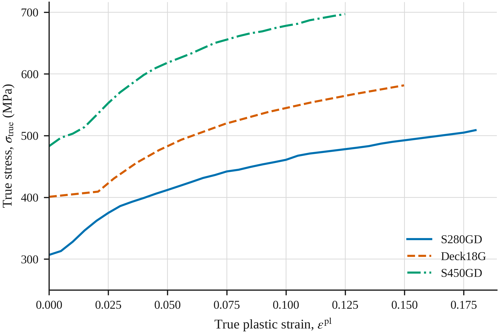

Fig. 18. Steel hardening curves: true stress against logarithmic plastic strain, ending at the pre-necking cut-offs.

CFS properties vary with thickness, coupon location, rolling direction and cold work, and the corner response can be predicted only from parent-material data combined with corner geometry, or from corner coupons [16]. One curve per steel case is used for all thicknesses so that geometric effects are isolated; corner strengthening, anisotropy and coil-to-coil scatter are not modelled for lack of calibration data.

### 5.1.2 Concrete in compression

The uniaxial compressive curve follows Carreira and Chu [17]:

$\frac{\sigma_{c}}{f'_{c}} = \frac{\beta\left( \varepsilon_{c}/\varepsilon'_{c} \right)}{\beta - 1 + \left( \varepsilon_{c}/\varepsilon'_{c} \right)^{\beta}}$ (10)

where σc is the stress at strain εc, ε′c is the strain at f′c and β is a shape parameter. When the initial tangent modulus Eit is known,

$\beta = \frac{1}{1 - \frac{f'_{c}}{E_{it}\varepsilon'_{c}}}$ (11)

and when only f′c is available the empirical estimates of [17] are used:

$\beta = \left( \frac{f'_{c}}{32.4} \right)^{3} + 1.55\quad\quad$ (12)

$\varepsilon'_{c} = \left( 0.71f'_{c} + 168 \right) \times 10^{- 5}$ (13)

with f′c in MPa. The β expression was calibrated up to about 34.5 MPa, so its use for C35 is a slight extrapolation. The hardening curve is defined in terms of inelastic strain [15],

$\varepsilon_{c}^{in} = \varepsilon_{c} - \frac{\sigma_{c}}{E_{0}}$ (14)

and its first point must have zero inelastic strain. The elastic limit is set at σc0 = 0.40f′c; the offset Δε0 = εc0,CC − σc0/E0, where εc0,CC is the Carreira–Chu strain at σc0, is subtracted from all post-yield strains, which keeps the shape of the curve and gives a first pair (σc0, 0). Table 4 lists the parameters and Fig. 19 the curves, which are truncated at a strain of 0.03 for numerical purposes.

Table 4. Parameters of the concrete compression curves.

| **Case** | **f*′*c (MPa)** | **β** | **ε*′*c** | **E₀ (GPa)** | ***σ*c0 = 0.40f*′*c (MPa)** |
|----------|----------------------------|-------|----------------------|--------------|---------------------------------------------------|
| C20      | 20                         | 1.785 | 0.001822             | 24.038       | 8.0                                               |
| C28      | 28                         | 2.195 | 0.001879             | 28.442       | 11.2                                              |
| C35      | 35                         | 2.811 | 0.001929             | 31.799       | 14.0                                              |

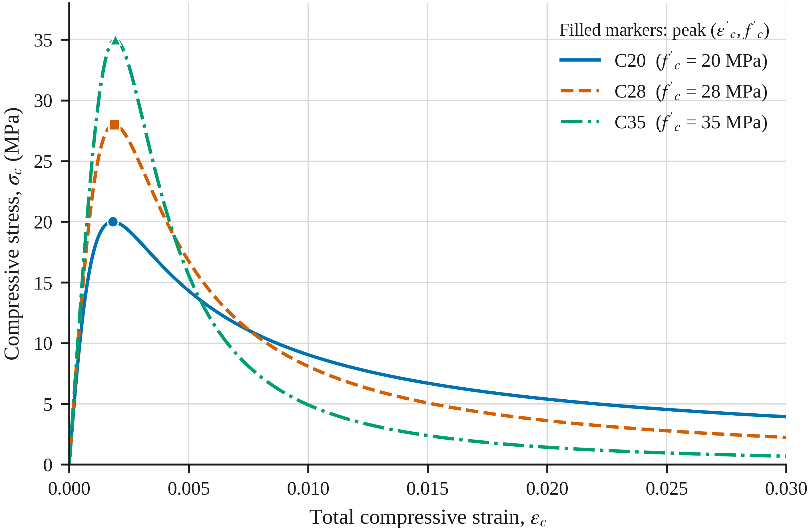

Fig. 19. Carreira–Chu compression curves against total strain.

Following Rahnavard et al. [1], the compression damage dc is zero up to the peak stress and increases on the descending branch as

$d_{c}\  = \ 1\  - \ \frac{\sigma_{c}}{{f'}_{c}}$ (15)

Abaqus derives the plastic strain from the inelastic strain and dc [15]; the hardening and damage tables share the same abscissae, and the resulting plastic strains were checked to be non-negative and non-decreasing (Fig. 20).

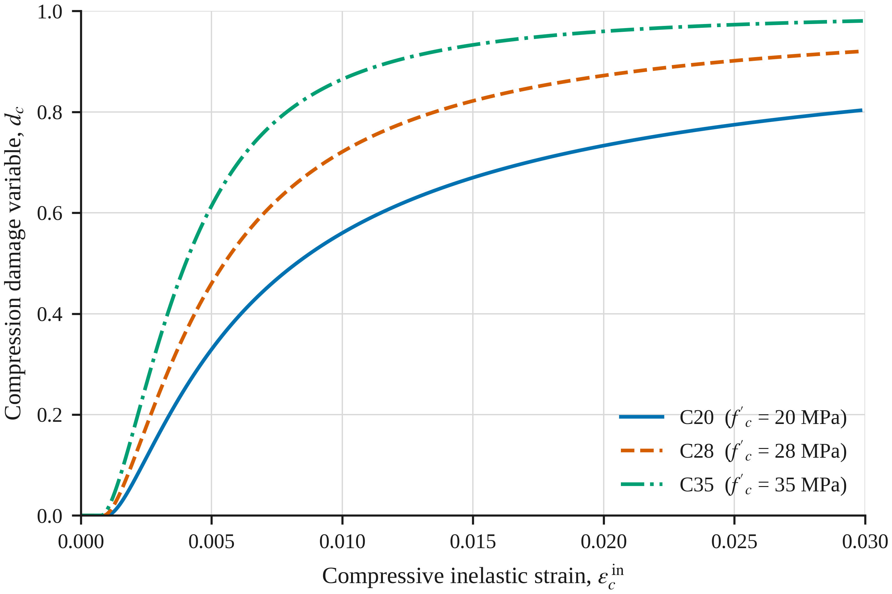

Fig. 20. Compression damage against inelastic strain.

### 5.1.3 Concrete in tension

The tensile response is linear up to fctm, and the post-cracking response follows fib Model Code 2020 [18] without its optional nonlinear pre-peak branch. In the absence of tensile tests,

$f_{ctm} = 1.8\ln\left( f_{ck} \right) - 3.1\quad\text{MPa}.$ (16)

with fck in MPa. Softening follows the bilinear stress–crack-opening law

$\sigma_{ct} = f_{ctm}\left( 1 - 0.8\frac{w}{w_{1}} \right),\quad\quad 0 \leq w \leq w_{1},$ (17)

$\sigma_{ct} = f_{ctm}\left( 0.25 - 0.05\frac{w}{w_{1}} \right),\quad\quad w_{1} < w \leq w_{c},$ (18)

where w is the crack opening and

$w_{1} = \frac{G_{F}}{f_{ctm}},\quad\quad w_{c} = \frac{5G_{F}}{f_{ctm}},$ (19)

so the stress drops to 0.2fctm at w1 and to zero at wc. Without a measured fracture energy, GF of normal-weight concrete is estimated as

$G_{F} = 85f_{ck}^{0.15}\quad\text{N/m}.$ (20)

Expressing softening in terms of crack opening removes the direct mesh-size dependence, although element type, mesh orientation and crack path still affect the response [19]. Table 5 lists the tensile parameters and Fig. 21 the softening laws.

Table 5. Tensile parameters and Abaqus end points.

| **Case** | **f*′*c (MPa)** | ***f*ctm (MPa)** | ***G*F (N/mm)** | ***w*₁ (mm)** | ***w*0.01 = 4.8*w*₁ (mm)** |
|----------|----------------------------|-----------------------------|----------------------------|---------------|---------------------------------------|
| C20      | 20                         | 2.292                       | 0.1332                     | 0.0581        | 0.2790                                |
| C28      | 28                         | 2.898                       | 0.1401                     | 0.0484        | 0.2321                                |
| C35      | 35                         | 3.300                       | 0.1449                     | 0.0439        | 0.2108                                |

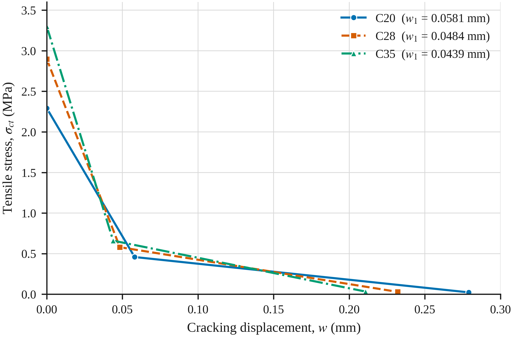

Fig. 21. Bilinear tensile softening laws, ending at w0.01.

Because fib gives no damage law, the scalar damage definition of [1],

$d_{t} = 1 - \frac{\sigma_{ct}}{f_{ctm}}.$ (21)

is combined with the two softening branches to give

$d_{t} = 0.8\frac{w}{w_{1}},\quad\quad 0 \leq w \leq w_{1},$ (22)

$d_{t} = 0.75 + 0.05\frac{w}{w_{1}},\quad\quad w_{1} < w \leq w_{c}.$ (23)

so that dt rises to 0.80 at w1 (Fig. 22). The input ends at w0.01 = 4.8w1, where σt = 0.01fctm and dt = 0.99, within the limits of the implementation [15]. Tension stiffening and damage are defined as functions of displacement (reference length 1.0 mm) on identical abscissae starting at w = 0.

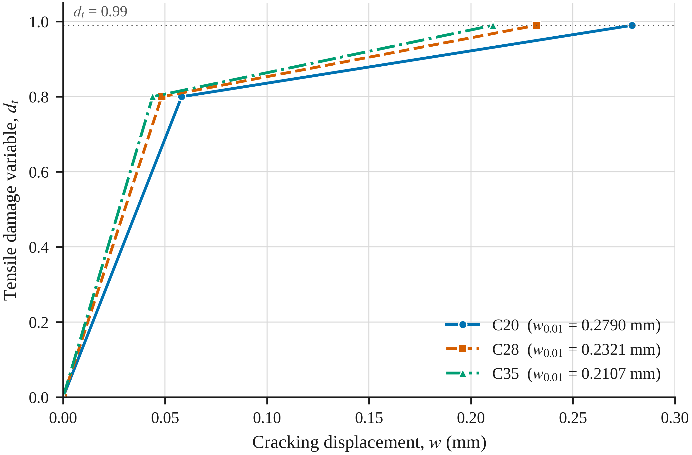

Fig. 22. Tensile damage against crack opening.

The plasticity parameters are listed in Table 6. The dilation angle is 36°, and the other parameters take their default values [15]. The viscosity parameter is inactive in the explicit solver.

Table 6. CDP plasticity parameters (all concrete cases).

| **Parameter**                   | **Symbol**                        | **Value** | **Basis**                          |
|---------------------------------|-----------------------------------|-----------|------------------------------------|
| Dilation angle                  | ψ                                 | 36°       | Adopted baseline                   |
| Flow eccentricity               | e                                 | 0.10      | Implementation default [15]      |
| Biaxial-to-uniaxial yield ratio | *f*b0/*f*c0 | 1.16      | Implementation default [15]      |
| Deviatoric-section parameter    | *K*c                   | 0.667     | Implementation default, 2/3 [15] |
| Viscosity parameter             | μ                                 | 0.001     | Not active in the explicit solver  |

## 5.2 Discretization, interactions and mesh sensitivity

The sheets and the local bearing plates are meshed with S4R shells, the concrete and the loading and support blocks with C3D8R solids, the screws with B31 beams and the bars with T3D2 trusses. Mesh sensitivity was checked on the 4 m model with the four meshes of Table 7, varying the primary-sheet and topping element sizes while keeping 10 mm for the deck and infill concrete, 5 mm for the screws and 20 mm for the bars and loading components. \[to be updated after the revised Abaqus runs\]

Table 7. Mesh sensitivity of the 4 m Deck18G–C28 model. \[to be updated after the revised Abaqus runs\]

| **Model** | **Primary sheet (mm)** | **Infill concrete (mm)** | **Concrete topping (mm)** | ***F*max (kN)**       | **EI at 0.4*F*max (kN·m²)** |
|-----------|------------------------|--------------------------|---------------------------|----------------------------------|----------------------------------------|
| Model-1   | 20                     | 10                       | 20                        | 64.326 | 3043.02      |
| Model-2   | 10                     | 10                       | 20                        | 64.662 | 3067.53      |
| Model-3   | 10                     | 10                       | 10                        | 64.624 | 3049.52      |
| Model-4   | 5                      | 10                       | 20                        | 64.451 | 3021.70      |

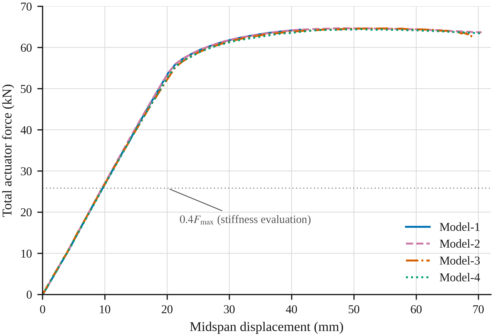

Fig. 23. Load–midspan displacement of the four meshes of the 4 m model. \[to be updated after the revised Abaqus runs\]

General contact is used with hard normal behaviour and a friction coefficient of 0.30. The screw beams are tied to the deck through beam-type connectors, and the sheet-to-sheet attachment uses fastener elements with Cartesian behaviour. Screws and bars are embedded in the concrete, which implies no slip between screw and concrete; this is consistent with the small slips measured by Li et al. [6] but leaves local anchorage behaviour unresolved.

## 5.3 Analysis procedure and boundary conditions

The explicit solver was used to handle material, geometric and contact nonlinearity. Mass scaling targeted a stable increment of 2 × 10⁻⁶ s, displacement was applied with a smooth amplitude, and the kinetic-to-internal energy ratio was kept below 5%. The two loading blocks were coupled to reference points linked by a beam constraint to a control point free to move only vertically; its reaction is the total applied force. The supports allow the rotations of a simple support and longitudinal movement at one end.

## 5.4 Verification

The modelling approach was verified against specimens 2C-P1, 2C-P2 and 2C+C-P2 of Rahnavard et al. [1], using their geometry, materials, loading and supports. Replacing explicit three-dimensional bolts by connector elements changed the global response negligibly. The predicted ultimate loads differ from the published values by −0.6% to +5.8% (Table 8, Fig. 24). These specimens use lightweight concrete, bolts and built-up sections, so the agreement supports the modelling approach but not the proposed floor or its screws.

Table 8. Measured [1] and predicted ultimate loads.

| **Specimen** | ***F*Exp (kN)** | ***F*FEM (kN)** | ***F*FEM/*F*Exp** | **Error (%)** |
|--------------|----------------------------|----------------------------|-----------------------------------------|---------------|
| 2C-P1        | 219.55                     | 223.13                     | 1.016                                   | +1.6          |
| 2C-P2        | 181.44                     | 180.30                     | 0.994                                   | −0.6          |
| 2C+C-P2      | 163.01                     | 172.51                     | 1.058                                   | +5.8          |

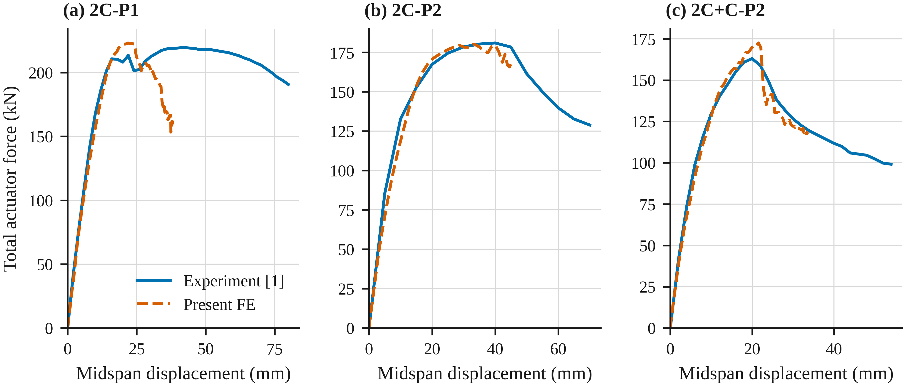

Fig. 24. Measured [1] and predicted responses of (a) 2C-P1, (b) 2C-P2 and (c) 2C+C-P2.

## 5.5 Response of the reported designs

The FE moment resistance is obtained from the peak total load of the third-point loading as

$M_{n,FE}\  = \ \frac{F_{\max}L}{6}$ (24)

and the equivalent rigidity from the secant at 0.4Fmax as

${EI}_{FE}\  = \ \frac{23F_{0.4}L^{3}}{1296\delta_{0.4}}$ (25)

where δ0.4 is the midspan displacement at F0.4 = 0.4Fmax. Table 9 compares these values, per metre width, with the nominal analytical resistance (before ϕ) and the transformed-section rigidity of the reported designs. \[to be updated after the revised Abaqus runs\]

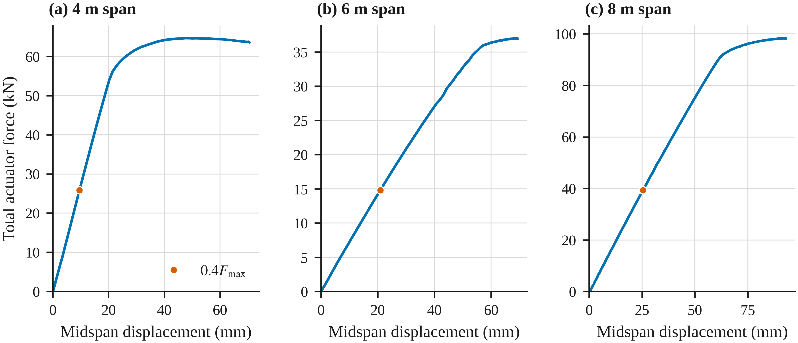

Fig. 25. FE response of the reported Deck18G–C28 designs: (a) 4 m, (b) 6 m, (c) 8 m. \[to be updated after the revised Abaqus runs\]

Table 9. FE and analytical moment resistance and rigidity per metre width. Analytical values are those of the reported designs; FE values \[to be updated after the revised Abaqus runs\]

| *L (m)* | *Mn,FE (kN·m/m)* | EIFE (kN·m²/m)   | *Mn,Ana (kN·m/m)* | EIAna (kN·m²/m) | *Mn,FE/Mn,Ana* | EIFE/EIAna |
|---------|-----------------------------|-----------------------------|------------------------------|----------------------------|--------------------------------------|----------------------------------|
| 4       | – | – | 24.81                        | 1288.8                     | –          | –      |
| 6       | – | – | 61.13                        | 4312.9                     | –          | –      |
| 8       | – | – | 106.71                       | 10478.7                    | –          | –      |

## 5.6 Longitudinal connector forces

Fig. 26 shows the longitudinal screw forces along the span. \[to be updated after the revised Abaqus runs\] The plotted forces are snapshots at one analysis time; checking the connection would require the peak force in each screw over the full load history, compared with a resistance obtained from tests of this detail.

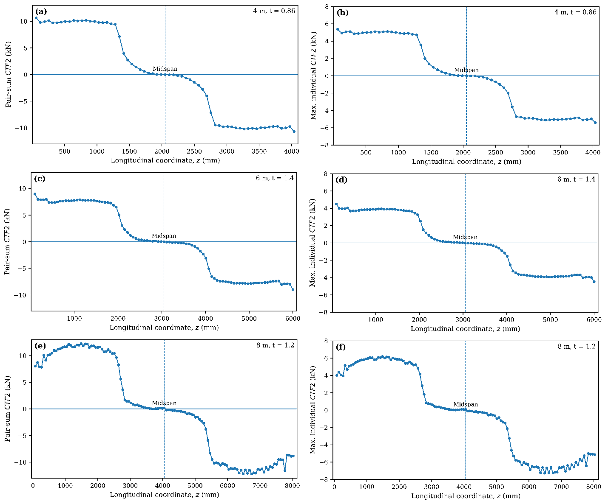

Fig. 26. Longitudinal screw forces in the (a, b) 4 m, (c, d) 6 m and (e, f) 8 m models: pair sums (left) and individual screws (right). \[to be updated after the revised Abaqus runs\]

# 6. Limitations

Full interaction is assumed. The connection check combines sheet bearing with a shank limit derived from the manufacturer’s laboratory shear value, which the manufacturer describes as indicative and which is not a characteristic value in the sense of Chapter K of AISI S100-24. Neglecting the share of the secondary deck in the longitudinal force relies on the force-distribution argument of Section J4.3.2. The tests of Li et al. [6] support the connection concept, but the PATTA M6.3/5.5 screw and the orthogonal sheet arrangement differ from the tested detail, so push-out tests are needed to establish its resistance and slip stiffness. The web depth is taken as the full centreline length, which slightly overstates the shear area.

The results hold within the discrete domain of Table 2. The topping and the top flange sit at their lower bounds in 51 and 37 reported designs, and the profile height in 6, so wider bounds could change the weights, the geometry and the two infeasible S450GD–C20 cases. The reported design is not the mathematical minimum but lies within 1.33% of it.

The two floors are selected with analogous, not identical, rules, and they differ in construction method (shored beams against unshored sheets). The reference designs use one stud per rib over the web and meet the 38 mm stud extension and 12.7 mm cover only at the limit. Screws and studs are not compared as measures of construction effort.

Deflections are short-term values from uncracked sections. The construction stage of the primary sheet itself is not checked. The FE verification uses specimens with lightweight concrete and bolted built-up sections, and the FE study covers three of the 52 reported designs under four-point rather than uniform loading.

# 7. Conclusions

An orthogonal two-sheet CFS–concrete floor was optimized by exhaustive enumeration of its primary geometry, topping, secondary deck and screw arrangement for 54 span–material cases, and compared with an independently optimized W-section composite floor. The main findings are as follows.

\(1\) Feasible designs exist in 52 cases; S450GD–C20 has none at 8 and 9 m. The reported designs weigh 1.485–1.813 kN/m², are 134.7–325.3 mm deep, and coincide with W\* in 23 cases or exceed it by at most 1.33%.

\(2\) Total-service deflection governs 22 designs, web shear 12 and the steel–concrete force balance 9. Live-load deflection never governs, and 99 non-governing ratios exceed 0.95.

\(3\) The low-weight region shrinks with span: in the Deck18G cases studied, the share of feasible designs within 5% of W\* drops from 13.9% at 4 m to 0.01% at 9 m. At 4 m both the connection and deflection ratios can be reduced to 0.8 for 0.29% extra weight, whereas at 9 m almost no reserve can be obtained within 5%.

\(4\) Compared with the reference, 51 of 52 proposed floors are lighter (mean 11.6%) and all are shallower (mean 29.0%). Total steel is lower in 51 cases, but beyond 5 m this results from the thinner deck; the primary sheet alone is heavier than the W-section from 6 m onward.

\(5\) The proposed floors use on average 97% of the L/240 total-deflection limit, against 20–94% for the reference, and exceed the reference strength- and stiffness-to-mass indices in only 8 and 11 cases. The benefit is a lighter and shallower floor, obtained largely by using the serviceability allowance more fully.

Push-out tests of the screw detail, a construction-stage check of the primary sheet and wider search bounds are the next steps; re-optimization with test-based connection properties would show how far these conclusions carry over.

## CRediT authorship contribution statement

\[To be completed.\]

## Declaration of competing interest

The authors declare that they have no known competing financial interests or personal relationships that could have appeared to influence the work reported in this paper.

## Data availability

\[To be completed: repository/DOI of the optimization code, configuration and result files.\]

# Appendix A. Reported designs

Table A1 lists the reported design of every case. The topping is 50 mm in 51 designs and 60 mm for S450GD–C20 at 7 m. Fig. A1 maps the deck, rib pitch, row number and screw number, and Fig. A2 the weight components.

Table A1. Reported designs. Lengths in mm, θp in degrees, W in kN/m²; tp rounded to 0.01 mm.

| ***L* (m)** | **Steel / concrete** | ***h*p** | ***b*p,b** | ***b*p,t** | ***θ*p** | ***t*p** | **Deck / gauge** | ***D*** | ***W*** | **Rows** | **Governing check**          |
|-------------|----------------------|---------------------|-----------------------|-----------------------|---------------------|---------------------|------------------|---------|---------|----------|------------------------------|
| 4           | S280GD / C20         | 70                  | 130                   | 50                    | 80                  | 0.45                | D2 / 28          | 136.3   | 1.506   | 1        | Web shear                    |
| 4           | S280GD / C28         | 70                  | 110                   | 50                    | 75                  | 0.45                | D2 / 28          | 136.3   | 1.505   | 1        | Flexural resistance          |
| 4           | S280GD / C35         | 70                  | 110                   | 50                    | 75                  | 0.45                | D1 / 28          | 134.7   | 1.485   | 1        | Flexural resistance          |
| 4           | Deck18G / C20        | 90                  | 110                   | 110                   | 60                  | 0.61                | D2 / 28          | 156.5   | 1.513   | 2        | Web shear                    |
| 4           | Deck18G / C28        | 70                  | 120                   | 50                    | 75                  | 0.45                | D2 / 28          | 136.3   | 1.504   | 2        | Total deflection             |
| 4           | Deck18G / C35        | 70                  | 100                   | 50                    | 70                  | 0.45                | D2 / 28          | 136.3   | 1.503   | 1        | Total deflection             |
| 4           | S450GD / C20         | 120                 | 60                    | 270                   | 85                  | 0.61                | D1 / 28          | 184.9   | 1.507   | 2        | Web slenderness              |
| 4           | S450GD / C28         | 80                  | 70                    | 60                    | 70                  | 0.45                | D2 / 28          | 146.3   | 1.507   | 1        | Steel–concrete force balance |
| 4           | S450GD / C35         | 70                  | 110                   | 50                    | 70                  | 0.45                | D2 / 28          | 136.3   | 1.502   | 2        | Web shear                    |
| 5           | S280GD / C20         | 100                 | 200                   | 50                    | 80                  | 0.61                | D2 / 28          | 166.5   | 1.525   | 2        | Total deflection             |
| 5           | S280GD / C28         | 90                  | 340                   | 50                    | 70                  | 0.75                | D2 / 28          | 156.6   | 1.525   | 2        | Total deflection             |
| 5           | S280GD / C35         | 90                  | 300                   | 50                    | 65                  | 0.75                | D2 / 28          | 156.6   | 1.524   | 2        | Total deflection             |
| 5           | Deck18G / C20        | 110                 | 200                   | 120                   | 65                  | 0.75                | D2 / 28          | 176.6   | 1.528   | 2        | Steel–concrete force balance |
| 5           | Deck18G / C28        | 90                  | 380                   | 50                    | 70                  | 0.75                | D2 / 28          | 156.6   | 1.523   | 2        | Total deflection             |
| 5           | Deck18G / C35        | 90                  | 380                   | 50                    | 70                  | 0.75                | D1 / 28          | 155.0   | 1.503   | 2        | Total deflection             |
| 5           | S450GD / C20         | 140                 | 110                   | 240                   | 75                  | 0.75                | D1 / 28          | 205.0   | 1.518   | 2        | Steel–concrete force balance |
| 5           | S450GD / C28         | 110                 | 140                   | 50                    | 70                  | 0.61                | D1 / 28          | 174.9   | 1.504   | 1        | Web shear                    |
| 5           | S450GD / C35         | 100                 | 200                   | 50                    | 75                  | 0.61                | D2 / 28          | 166.5   | 1.521   | 2        | Web shear                    |
| 6           | S280GD / C20         | 120                 | 450                   | 50                    | 75                  | 0.91                | D2 / 28          | 186.8   | 1.544   | 2        | Total deflection             |
| 6           | S280GD / C28         | 120                 | 410                   | 50                    | 70                  | 0.91                | D2 / 28          | 186.8   | 1.542   | 2        | Total deflection             |
| 6           | S280GD / C35         | 120                 | 410                   | 50                    | 70                  | 0.91                | D1 / 28          | 185.2   | 1.522   | 2        | Total deflection             |
| 6           | Deck18G / C20        | 140                 | 270                   | 110                   | 65                  | 0.91                | D2 / 28          | 206.8   | 1.545   | 2        | Steel–concrete force balance |
| 6           | Deck18G / C28        | 120                 | 490                   | 50                    | 75                  | 0.91                | D1 / 28          | 185.2   | 1.522   | 2        | Total deflection             |
| 6           | Deck18G / C35        | 120                 | 450                   | 50                    | 70                  | 0.91                | D2 / 28          | 186.8   | 1.541   | 2        | Web shear                    |
| 6           | S450GD / C20         | 170                 | 140                   | 230                   | 70                  | 0.91                | D1 / 28          | 235.2   | 1.535   | 2        | Steel–concrete force balance |
| 6           | S450GD / C28         | 130                 | 320                   | 50                    | 60                  | 0.91                | D1 / 28          | 195.2   | 1.521   | 2        | Steel–concrete force balance |
| 6           | S450GD / C35         | 120                 | 480                   | 50                    | 70                  | 0.91                | D1 / 28          | 185.2   | 1.520   | 2        | Total deflection             |
| 7           | S280GD / C20         | 160                 | 330                   | 50                    | 80                  | 0.91                | D2 / 28          | 226.8   | 1.564   | 2        | Total deflection             |
| 7           | S280GD / C28         | 160                 | 330                   | 50                    | 80                  | 0.91                | D1 / 28          | 225.2   | 1.544   | 1        | Connection capacity          |
| 7           | S280GD / C35         | 160                 | 290                   | 50                    | 75                  | 0.91                | D2 / 28          | 226.8   | 1.561   | 2        | Total deflection             |
| 7           | Deck18G / C20        | 180                 | 280                   | 120                   | 55                  | 1.20                | D1 / 28          | 245.5   | 1.550   | 2        | Web shear                    |
| 7           | Deck18G / C28        | 160                 | 350                   | 50                    | 80                  | 0.91                | D1 / 28          | 225.2   | 1.542   | 2        | Total deflection             |
| 7           | Deck18G / C35        | 160                 | 350                   | 50                    | 80                  | 0.91                | D1 / 28          | 225.2   | 1.542   | 2        | Web shear                    |
| 7           | S450GD / C20         | 220                 | 170                   | 300                   | 70                  | 1.20                | D1 / 28          | 295.5   | 1.813   | 2        | Steel–concrete force balance |
| 7           | S450GD / C28         | 170                 | 250                   | 50                    | 70                  | 0.91                | D2 / 28          | 236.8   | 1.560   | 2        | Web shear                    |
| 7           | S450GD / C35         | 160                 | 320                   | 50                    | 75                  | 0.91                | D2 / 28          | 226.8   | 1.559   | 2        | Total deflection             |
| 8           | S280GD / C20         | 190                 | 470                   | 50                    | 70                  | 1.20                | D2 / 28          | 257.1   | 1.581   | 2        | Web shear                    |
| 8           | S280GD / C28         | 180                 | 550                   | 50                    | 75                  | 1.20                | D2 / 28          | 247.1   | 1.580   | 2        | Total deflection             |
| 8           | S280GD / C35         | 190                 | 400                   | 50                    | 65                  | 1.20                | D1 / 28          | 255.5   | 1.559   | 2        | Web shear                    |
| 8           | Deck18G / C20        | 220                 | 310                   | 150                   | 70                  | 1.20                | D1 / 28          | 285.5   | 1.569   | 2        | Neutral-axis position        |
| 8           | Deck18G / C28        | 190                 | 500                   | 50                    | 70                  | 1.20                | D1 / 28          | 255.5   | 1.559   | 2        | Web shear                    |
| 8           | Deck18G / C35        | 190                 | 420                   | 50                    | 65                  | 1.20                | D2 / 28          | 257.1   | 1.578   | 2        | Total deflection             |
| 8           | S450GD / C20         | —                   | —                     | —                     | —                   | —                   | —                | —       | —       | —        | No feasible design           |
| 8           | S450GD / C28         | 200                 | 320                   | 50                    | 60                  | 1.20                | D2 / 28          | 267.1   | 1.579   | 2        | Total deflection             |
| 8           | S450GD / C35         | 180                 | 630                   | 50                    | 75                  | 1.20                | D1 / 28          | 245.5   | 1.556   | 2        | Total deflection             |
| 9           | S280GD / C20         | 220                 | 500                   | 100                   | 60                  | 1.52                | D3 / 26          | 296.9   | 1.726   | 2        | Neutral-axis position        |
| 9           | S280GD / C28         | 210                 | 460                   | 50                    | 80                  | 1.20                | D3 / 26          | 286.6   | 1.722   | 2        | Total deflection             |
| 9           | S280GD / C35         | 210                 | 590                   | 50                    | 60                  | 1.52                | D2 / 28          | 277.4   | 1.600   | 2        | Total deflection             |
| 9           | Deck18G / C20        | 250                 | 250                   | 250                   | 70                  | 1.52                | D4 / 26          | 325.3   | 1.733   | 2        | Steel–concrete force balance |
| 9           | Deck18G / C28        | 240                 | 430                   | 230                   | 65                  | 1.52                | D2 / 28          | 307.4   | 1.608   | 2        | Connection capacity          |
| 9           | Deck18G / C35        | 210                 | 700                   | 70                    | 65                  | 1.52                | D1 / 28          | 275.8   | 1.580   | 2        | Neutral-axis position        |
| 9           | S450GD / C20         | —                   | —                     | —                     | —                   | —                   | —                | —       | —       | —        | No feasible design           |
| 9           | S450GD / C28         | 230                 | 370                   | 80                    | 75                  | 1.20                | D4 / 26          | 305.0   | 1.705   | 2        | Steel–concrete force balance |
| 9           | S450GD / C35         | 220                 | 500                   | 50                    | 80                  | 1.20                | D1 / 28          | 285.5   | 1.577   | 2        | Neutral-axis position        |

D1 = 0.6C-30/0.6C-35, D2 = 0.6C-36 (gauge 28); D3 = 1.0C-32, D4 = 1.0C-33 (gauge 26). D: total depth; Rows: screw rows per intersection; last column: largest utilization ratio in Fig. 7.

Fig. A1. Topping, rib pitch, secondary deck, screw rows per intersection and required half-span screw number of the reported designs.

Fig. A2. Weight components of the reported designs (primary sheet, secondary deck, trough concrete and topping).

# Appendix B. Supplementary design-space plots

Fig. B1. Geometry of the designs with g ≤ 5% in the four detailed cases. Axes span the full search grid; black: minimum-weight design; dashed orange: reported design; line colour: weight excess.

Fig. B2. Lowest connection (a) and total-deflection (b) utilization obtainable within a weight excess ε. The two panels may refer to different designs.

Fig. B3. Weight against screw density for the designs with g ≤ 5%. Orange: non-dominated designs; star: minimum-weight design; diamond: reported design.

# Appendix C. Detailed comparison with the conventional floor

Fig. C1. Paired weight (a) and depth (b) of all 54 cases.

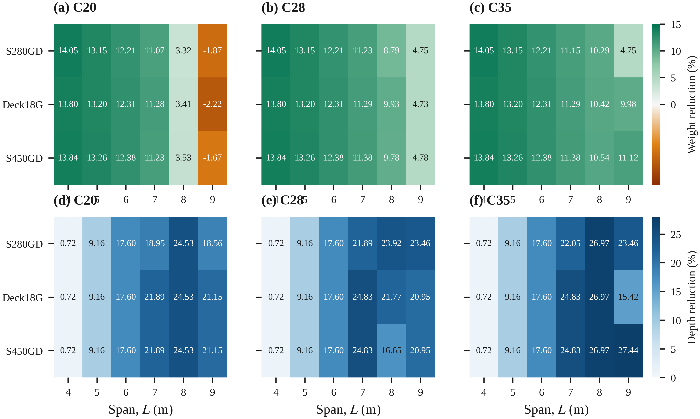

Fig. C2. Weight reduction (a–c) and depth reduction (d–f) against span by concrete strength.

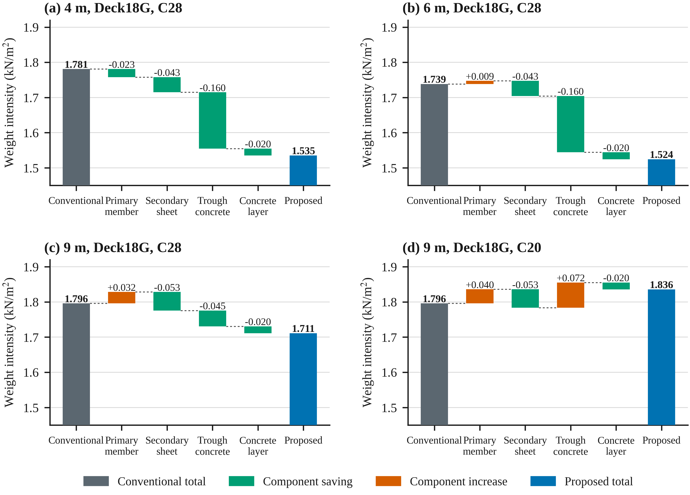

Fig. C3. Component contributions to the weight difference for selected cases. Negative values are savings of the proposed floor.

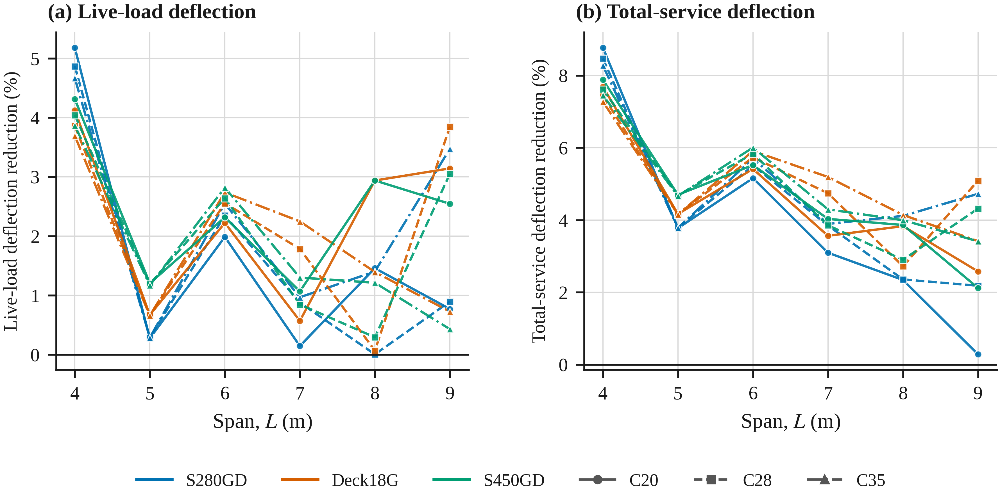

Fig. C4. Relative change in live-load (a) and total-service (b) deflection; positive values mean larger deflection of the proposed floor.

Fig. C5. Weight of the primary member (W-section or primary CFS sheet) per unit floor area for the nine steel–concrete combinations. Labels: W-section designation and sheet thickness; percentages: 100(Wbeam − Wsheet)/Wbeam.

Fig. C6. Primary-member weight: (a) span-wise means with min–max ranges; (b) mean paired reduction.

# References

[1] Rahnavard, R., Craveiro, H.D., Simões, R.A., Laím, L., and Santiago, A. Test and design of built-up cold-formed steel–lightweight concrete (CFS-LWC) composite beams. Thin-Walled Structures 193 (2023), 111211. https://doi.org/10.1016/j.tws.2023.111211.

[2] Rahnavard, R., Craveiro, H.D., Simões, R.A., Torabian, S., and Schafer, B.W. Built-up cold-formed steel lightweight concrete (CFS-LWC) composite beams: applicability of EN 1994-1-1 and AISC 360. Thin-Walled Structures 214 (2025), 113301. https://doi.org/10.1016/j.tws.2025.113301.

[3] Rahnavard, R., Craveiro, H.D., Simões, R.A., and Torabian, S. Cold-formed steel lightweight concrete (CFS-LWC) composite beams: new design proposal. Structures 87 (2026), 111596. https://doi.org/10.1016/j.istruc.2026.111596.

[4] Kyvelou, P., Gardner, L., and Nethercot, D.A. Testing and analysis of composite cold-formed steel and wood-based flooring systems. Journal of Structural Engineering 143(11) (2017), 04017146. https://doi.org/10.1061/(ASCE)ST.1943-541X.0001885.

[5] Kyvelou, P., Gardner, L., and Nethercot, D.A. Finite element modelling of composite cold-formed steel flooring systems. Engineering Structures 158 (2018), 28–42. https://doi.org/10.1016/j.engstruct.2017.12.024.

[6] Li, H., Zhou, X., Shi, Y., Gao, Y., and Xu, J. Flexural behavior of CFS composite truss: test, simulation, and theoretical calculation. Engineering Structures 366 (2026), 123320. https://doi.org/10.1016/j.engstruct.2026.123320.

[7] Li, H., Shi, Y., Lu, W., Gao, Y., Xu, J., and Ge, J. Flexural behavior of CFS trusses with strengthened joints. Thin-Walled Structures 220 (2026), 114393. https://doi.org/10.1016/j.tws.2025.114393.

[8] Caswell V, H.L., Torabian, S., and Schafer, B.W. 2022-03 FastFloor residential test report. Cold-Formed Steel Research Consortium Report CFSRC R-2022-03, Johns Hopkins University, 2022. https://jscholarship.library.jhu.edu/handle/1774.2/67741.

[9] American Iron and Steel Institute. ANSI/AISI S100-24, North American specification for the design of cold-formed steel structural members. AISI, Washington, DC, 2024.

[10] Nucor Vulcraft. Steel deck solutions: product geometry, section properties and load tables, August 2021. Nucor Vulcraft Group.

[11] Steel Deck Institute. ANSI/SDI SD-2022, Standard for steel deck. SDI, Allison Park, PA, 2022.

[12] Nucor Vulcraft. Composite deck–slab load-table calculation reports, V1.0.0 Beta, for 1.5VL-36, 1.5VLR-36, 2PLVLI-36 and 3PLVLI-36.

[13] American Institute of Steel Construction. ANSI/AISC 360-22, Specification for structural steel buildings. AISC, Chicago, IL, 2022.

[14] American Institute of Steel Construction. AISC shapes database v16.0. AISC, Chicago, IL, 2023. https://www.aisc.org/publications/steel-construction-manual-resources/.

[15] Dassault Systèmes. Abaqus 2024 documentation: inelastic behavior; concrete damaged plasticity. Dassault Systèmes Simulia Corp., Providence, RI, 2023.

[16] Chen, J., Chen, Z., Liu, H., and Chan, T.-M. Implementation of cold-formed steel stress–strain relationships using limited available material parameters. Journal of Structural Engineering 150(10) (2024), 04024139. https://doi.org/10.1061/JSENDH.STENG-13749.

[17] Carreira, D.J., and Chu, K.-H. Stress–strain relationship for plain concrete in compression. ACI Journal Proceedings 82(6) (1985), 797–804. https://doi.org/10.14359/10390.

[18] fib – International Federation for Structural Concrete. fib Model Code for Concrete Structures (2020), Version 1.2. Lausanne, 2024. ISBN 978-2-88394-176-2.

[19] Hillerborg, A. The theoretical basis of a method to determine the fracture energy GF of concrete. Materials and Structures 18(4) (1985), 291–296. https://doi.org/10.1007/BF02472919.
